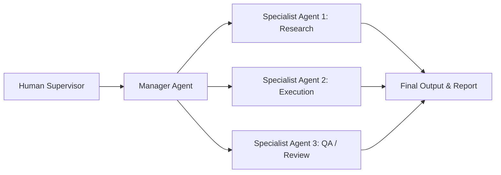

The Era of Prompts is Over; Here Comes the Era of Goals (The Rise of Agentic AI). Agentic AI represents the next major phase of artificial intelligence evolution. Unlike traditional AI systems that respond to discrete instructions, Agentic AI systems can plan, coordinate, and execute multi-step objectives with increasing autonomy. As organizations adopt agentic workflows and multi-agent systems, new opportunities emerge alongside challenges involving governance, security, accountability, and workforce transformation. This briefing document outlines the technical underpinnings, real-world applications, organizational impacts, and strategic steps required to navigate this shift.

## What Is Agentic AI?

Agentic AI refers to a profound shift in artificial intelligence where systems move beyond simply answering queries to actively pursuing and achieving complex, predefined objectives. In essence, Agentic AI operates by breaking down a high-level goal into smaller, manageable tasks, and then executing them autonomously. This capability defines the transition from conversational interfaces to proactive, autonomous problem-solvers. 

"In 2024, what we asked AI was: *'Can you write an email for me?'* However, in 2026, what we tell AI is: *'Execute a campaign to acquire 100 new customers this month and present me with the final report.'* This marks the revolutionary evolution of Artificial Intelligence from prompts to goals."

The world is currently in a critical phase of transformation toward the era of **Agentic AI**, moving away from a conversational chat mode that merely searches and retrieves information to systems that autonomously plan and execute complex, high-level objectives. If traditional AI was a map showing you the route, Agentic AI is an autonomous vehicle that drives you precisely to your destination.

## The Evolution from Chatbots to Agentic AI

The structural advancements made in AI technology over the last few years can be understood through the following evolution timeline:

| Period | Nature of AI | Operating Mechanism |
|---|---|---|
| **2022** | **Chatbots** | Responds to queries and conducts conversations in natural language. |
| **2023** | **Generative AI** | The widespread adoption of AI models capable of autonomously generating content such as text, images, and audio. |
| **2024** | **AI Copilots** | Acts as an assistant alongside humans to help with tasks (Coding, Writing). |
| **2025** | **AI Agents** | Systems capable of executing specific tasks either partially or fully autonomously. |
| **2026 (Emerging Trend)** | **Multi-Agent Systems & Agentic Workflows** | Multiple AI agents collaborate seamlessly as a team to support the execution of highly complex projects. |

## How AI Agents Work

To understand this paradigm shift, it's essential to look at how AI agents work under the hood. AI agents do not just generate text; they utilize a robust framework of reasoning, tool use, and memory to interact with digital environments. 

When assigned a goal, AI agents analyze the objective, formulate a multi-step plan, use external software (like APIs, browsers, or databases), evaluate their progress, and correct errors along the way. This operational independence is what makes AI agents far superior to standard Large Language Models (LLMs). They can monitor systems, make autonomous decisions, and provide outcomes with minimal human supervision.

## Multi-Agent Systems and Agentic Workflows

While a single AI agent is powerful, the true transformation occurs within Multi-Agent Systems. In these environments, different AI agents with specialized roles interact, negotiate, and collaborate to achieve a broader business objective. 

Agentic workflows define the processes and rules by which these Multi-Agent Systems operate. By establishing clear agentic workflows, organizations can ensure that specialized AI agents handle coding, testing, designing, and deployment in a synchronized manner.

**Diagram: Multi-Agent System Architecture**

*Here is a simplified breakdown of this architecture:*
1. **Human Supervisor:** A human manager sets the primary goal and provides the initial prompt or business objective.
2. **Manager Agent:** An AI acts as the central coordinator. It breaks the large goal down into smaller tasks and assigns them to specialized agents.
3. **Specialist Agents:** Each agent is built for a specific function.
   - *Research Agent:* Gathers data and context.
   - *Execution Agent:* Drafts the code, content, or campaign.
   - *QA / Review Agent:* Tests the output for quality and errors.
4. **Final Output & Report:** The specialist agents synthesize their work into a completed report or product and present it back to the human supervisor for final approval.

## Real-World Applications of Agentic AI

Beyond theoretical frameworks, here is how Agentic AI and multi-agent systems are driving operational transformation across key industry sectors today:

### Agentic AI in Software Development

Instead of tasks taking days or weeks in a typical software company, a team of diverse AI agents can now significantly accelerate major portions of the workload and exponentially boost overall productivity:

 * **Agent 1 (Requirement Analysis):** Analyzes the client’s requirements and designs a comprehensive project plan.
 * **Agent 2 (UI Design):** Conceptualizes and defines the layout and design structure of the website or application.
 * **Agent 3 (Code Generation):** Generates substantial portions of the required codebase and assists developers in accelerating implementation.
 * **Agent 4 (Testing):** Independently identifies bugs, run-time errors, and vulnerabilities, and rectifies them.
 * **Agent 5 (Deployment):** Assists with deployment workflows and transitions approved software releases into production environments.

### Agentic AI in Digital Marketing

A dedicated ecosystem of distinct AI agents operates collaboratively to scale sales and growth for an e-commerce enterprise through advanced agentic workflows:

 * **Market Research Agent:** Evaluates active market trends and analyzes competitor strategies.
 * **SEO Agent:** Identifies optimized target keywords to rank the company website higher on search engines.
 * **Content Agent:** Curates customized social media posts, copy, and ad creatives.
 * **Ad Campaign Agent:** Deploys ad campaigns on Google and Meta platforms while dynamically managing budget allocations.
 * **Analytics Agent:** Assesses customer engagement and conversions to refine and optimize the ongoing campaign.

## Emerging Technologies Powering Agentic AI

The technical landscape this year is heavily centered around these cutting-edge advancements that fuel Multi-Agent Systems:

 * **Agent-to-Agent Communication (A2A):** A mechanism where AI agents interact, share structured data, and delegate sub-tasks among themselves with minimal human intervention during routine coordination tasks.
 * **MCP (Model Context Protocol):** A new open standard designed to securely link AI agents with various software platforms and internal enterprise databases (such as ERP and CRM). Just as USB served as a universal standard to connect peripheral hardware to computers, MCP is emerging as a universal standard enabling seamless communication between different AI models and external development tools.
 * **AI Operating Systems (AI OS):** Moving away from the traditional architectures of computers and smartphones, AI-centric operating systems that increasingly assist users by anticipating intent and automating routine actions are expected to become increasingly widespread.

## Workforce Transformation in the Age of AI Agents

The rise of Agentic AI does not mean jobs will completely vanish; rather, industry experts highlight that automation will profoundly alter the core nature of existing roles. As AI agents and multi-agent systems take over mundane tasks, human workers will transition into supervisory and strategic positions.

### Roles Most Susceptible to Automation:
 * **Basic Data Entry:** Manual compilation and entry of raw data into computing systems.
 * **Repetitive Reporting:** Structuring and generating identical periodic reports month after month.
 * **Simple Customer Support:** Primary customer tier handling basic, routine queries.
 * **Routine Documentation:** Creating highly standardized, generic legal or technical documentation.

### New Career Frontiers Poised for Exponential Growth:
 * **AI Agent Manager:** Leaders who oversee specialized teams of AI agents and direct them with high-level objectives.
 * **AI Workflow Architect:** Professionals who design and map out how business processes can be streamlined utilizing agentic workflows.
 * **AI Security Specialist:** Technical experts focused on ensuring cyber security and data integrity across active agent operations.
 * **AI Governance Expert:** Professionals ensuring that AI agent behaviors comply strictly with legal frameworks and safety benchmarks.
 * **Human-AI Collaboration Consultant:** Consultants specializing in maximizing the workplace synergy and operational efficiency between human teams and AI networks.

## AI Governance, Security, and Accountability

As we grant higher autonomy to AI agents and multi-agent systems, global technology leaders and ethicists are raising critical regulatory questions regarding AI Governance:

 1. **Accountability for Decisions:** If a financial agent incurs a significant monetary loss, who holds liability? The developer who designed the system, or the enterprise that deployed it?
 2. **Mitigating Algorithmic Bias:** How can we guarantee that AI systems do not exhibit racial, gender-based, or socioeconomic biases when making autonomous decisions?
 3. **The Limits of Autonomy:** Is it safe to grant AI agents unchecked authority to manage bank accounts or alter sensitive corporate data infrastructure without human sign-offs?
 4. **Human-in-the-Loop:** How do we structurally ensure that critical thresholds require human approval? Especially within high-stakes domains like finance, healthcare, and legal sectors, human oversight will remain strictly mandatory for definitive, critical decisions.

## Strategic Implications for Organizations

As enterprises prepare for widespread adoption of agentic technologies, leadership teams should evaluate four critical pillars:

 * **Targeted Implementation:** Organizations should begin evaluating and piloting agentic workflows in low-risk, highly repeatable business functions before scaling across core operations.
 * **Proactive Governance:** Robust risk-mitigation frameworks and clear operational boundaries should be firmly established prior to large-scale infrastructure deployment of multi-agent systems.
 * **Workforce Upskilling:** Strategic corporate workforce development programs should pivot to place a heavy emphasis on fostering human-AI collaboration skills and data literacy to manage AI agents effectively.
 * **Adaptive Infrastructure:** Security, auditability, and corporate accountability mechanisms must adaptively evolve alongside expanding agent capabilities to preserve data integrity and brand trust.

## The Future of Agentic AI Beyond 2030

Within the next few years, the architecture of the corporate ecosystem is projected to transform drastically. By 2030, the integration of Multi-Agent Systems will be ubiquitous.

 * **Personal AI Team:** Many professionals will likely have access to personalized AI assistants or dedicated agent teams acting as force multipliers for their daily workflows.
 * **Digital Workforce:** Enterprises will see the rise of a structured 'digital workforce' operating in complete tandem alongside human employees via sophisticated agentic workflows.
 * **24/7 Autonomous Operations:** Even when corporate offices are closed, core business logistics, marketing cycles, and system optimizations will run uninterrupted 24 hours a day via autonomous AI agents.

> "Let us keep in mind, however, that the actual velocity of these projections will depend heavily on technological breakthroughs, alongside the evolution of regulatory frameworks, safety protocols, and mainstream societal acceptance."

## Key Takeaways

To ensure you stay ahead of this rapid technological shift, professionals and executives should actively focus on these core areas starting today:

 * **Master Emerging AI Tools:** Continuously track, evaluate, and adopt new AI applications and domain-specific tools relevant to your respective industry.
 * **Shift from Prompting to Goal Setting:** Cultivate the skill of clearly defining and structuring macro business objectives (Goals) for AI systems.
 * **Understand Agentic Workflows:** Learn the underlying technical frameworks of how different software integrations, APIs, and AI agents interact to build automated pipelines.
 * **Synthesize AI with Domain Knowledge:** Combine your deep industry experience (Domain Expertise) with the capabilities of AI. 
 * **Develop Human Oversight Skills:** Hone the managerial capability to critically audit, review, and fine-tune outputs delivered by AI agents, shifting focus toward strategic review rather than manual execution.

If the internet interconnected our world, and smartphones brought that world directly into our palms, Agentic AI has the potential to significantly reshape human productivity, organizational structures, and workforce dynamics. In this next quantum leap of technology, the future will not belong merely to those who know how to use AI tools, but to the leaders who can effectively steer, manage, and assign goals to intelligent agent ecosystems.

Remember, while AI will automate specific tasks across various sectors, it will simultaneously unlock a wave of new opportunities for professionals who possess the skills to leverage AI agents effectively. Those are the individuals who will consistently lead the competitive landscape of tomorrow.

---

## Frequently Asked Questions (FAQ)

**What is Agentic AI?**
Agentic AI refers to artificial intelligence systems designed to autonomously plan, adapt, and execute multi-step tasks to achieve a high-level goal, operating with minimal human intervention.

**How do AI Agents work?**
AI Agents work by reasoning through a given objective, breaking it down into actionable sub-tasks, utilizing external tools or APIs to perform those tasks, and iterating based on the results to successfully accomplish the goal.

**What are Multi-Agent Systems?**
Multi-Agent Systems are networks of multiple, specialized AI agents collaborating, communicating, and coordinating with each other to solve complex problems that go beyond the capabilities of a single agent.

**Will Agentic AI replace jobs?**
While Agentic AI will automate repetitive and routine tasks, it is expected to transform jobs rather than entirely replace them. It will create new roles focused on AI supervision, strategy, and managing agentic workflows.

**What is MCP (Model Context Protocol)?**
MCP (Model Context Protocol) is an emerging open standard that securely connects AI agents and models to external enterprise tools, software platforms, and databases, enabling seamless integration and data exchange.
